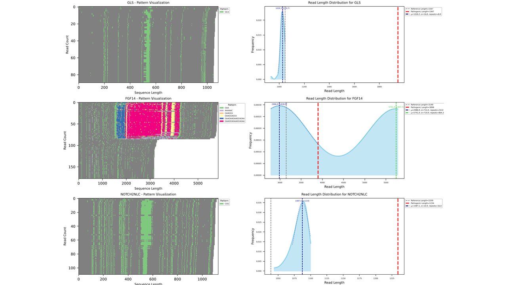

# STRiker

A Python tool for detecting short tandem repeats (STRs), analyzing motif patterns, and visualizing repeat number distributions in long read sequencing data (e.g., BAM files from Oxford Nanopore sequencing). 

---

## 📦 Features

- Detects STR motifs from reference sequence (e.g., GRCh38) and aligned BAM files 
- **Multiprocessing support** for significantly faster analysis of multiple genes
- Generates:
  - PDF reports with:
    - Visualization of STR motifs pattern for each region
    - Kernel Density Estimation (KDE) plots for read lengths for each region
  - Excel files with detailed motif statistics and repeat counts
  - Coverage analysis reports

---

## 🚀 Quick Start

### 1. Clone the repository

```bash
git clone https://github.com/BaeLab/STRiker
cd STRiker
```

### 2. Set up environment (conda recommended)


```bash
conda env create  --name STRiker -f environment.yaml
conda activate STRiker
```

### 3. Download Reference Genome (Recommended)

For optimal compatibility with most alignment tools, we recommend using the **GRCh38 no-alt analysis set** from NCBI:

```bash
# Download the reference genome
wget ftp://ftp.ncbi.nlm.nih.gov/genomes/all/GCA/000/001/405/GCA_000001405.15_GRCh38/seqs_for_alignment_pipelines.ucsc_ids/GCA_000001405.15_GRCh38_no_alt_analysis_set.fna.gz

# Decompress the file
gzip -d GCA_000001405.15_GRCh38_no_alt_analysis_set.fna.gz

# (Optional) Create an index for faster access
samtools faidx GCA_000001405.15_GRCh38_no_alt_analysis_set.fna
```

#### Why this reference?
This reference genome version:
- Contains chromosomes with UCSC-style names (chr1, chr2, etc.)
- Excludes alternative contigs that can complicate STR analysis
- Is optimized for alignment pipelines
- Maintains compatibility with most bioinformatics tools

For more information about choosing the right human reference genome, see [this guide by Heng Li](https://lh3.github.io/2017/11/13/which-human-reference-genome-to-use).


---

## 📂 Input Format

### 1. `input.bam` (required)
- BAM file containing aligned long reads. BAM files should be indexed and sorted.
- Aligned and indexed BAM file (`.bai` required)

### 2. `loci.csv` (required)
```csv
gene,chr,start,end,known_motif,pathogenic_expansion_number
HTT,chr4,3074876,3074941,CAG,35
ATXN8,chr13,70139383,70139428,CAG/TAG,73
```
Loci with multiple known motifs can be separated by `/` in the `known_motif` column.


---

## 🛠 Change parameters
You can change the motif-finding parameters by modifying the `__init__.py` file in the `config` directory. \
The parameters include:
- `min_repeat_length`: Minimum length of the repeat motif to be considered


## 🧬 Usage

### Display Help and Version
```bash
# Show help message
python STRiker.py --help

# Show version
python STRiker.py --version
```

### Basic Usage (Sequential Processing)
```bash
python STRiker.py <loci.csv> <reference.fasta> <bam_file> -o <output_dir>
```

### Multiprocessing Usage (Parallel Processing)
For faster processing with multiprocessing:

```bash
# Specify the number of processes to use (automatically enables parallel mode)
python STRiker.py <loci.csv> <reference.fasta> <bam_file> -o <output_dir> -p 4
```

### Arguments:
- `<loci.csv>`: CSV file containing gene loci information (required)
- `<reference.fasta>`: Reference genome FASTA file, e.g., GRCh38 (required, indexed)
- `<bam_file>`: Input BAM file with aligned reads (required)
- `-o`, `--output DIR`: (Optional) Output directory for all results. `motif_results/`
  and `gene_panel_output/` are created inside it, keeping results out of the
  raw-data folder. Default: current directory (`.`)
- `-p`, `--process N`: (Optional) Number of processes to use for multiprocessing.
  If omitted, runs in sequential mode.
- `-h`, `--help`: Show help message and exit
- `-v`, `--version`: Show version information and exit


### Example:
```bash
# Sequential processing, results into ./striker_out
python STRiker.py genes.csv GRCh38.fasta sample.bam -o striker_out

# Parallel processing with 8 cores
python STRiker.py genes.csv GRCh38.fasta sample.bam -o striker_out -p 8
```

---

## 🖼 Output

STRiker generates two directories inside the output directory specified by `-o`
(default: current directory):
- `gene_panel_output/`: Contains PDF reports and summary files for each gene
- `motif_results/`: Contains consolidated motif counts and summary statistics in `xlsx` format

### Example Output



The output includes:
- **Left panel**: Heatmap visualization of STR motif patterns for each read
- **Right panel**: Kernel Density Estimation (KDE) plot showing the distribution of read lengths

---


## 📄 License

This project is licensed under CC BY-NC-SA 4.0 - Non-commercial use only.

### Commercial Use
For commercial licensing inquiries, please contact bbakgosu@snu.ac.kr

## Usage Rights
- ✅ Personal use
- ✅ Educational use  
- ✅ Research use
- ❌ Commercial use (requires separate license)